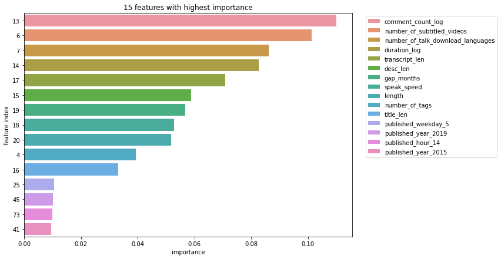

# Ted Talk Analysis

## Please refer to the .ipynb file for the entire analysis and report!

## Goal
In this TED talk analysis, we mainly used a TED talk dataset scraped on 24-JUN-20 from TED.com and https://www.kaggle.com/thegupta/ted-talk. This dataset contains 4609 rows and 52 columns where each row represents an individual talk and each column details information like speaker, transcript, and other related attributes for the corresponding talk. We also scraped a Wikipedia page to get the speaker's own Wikipedia page and join it with the original dataframe.

In the later part of this notebook, since we don't have a rating column in this main dataset, we had it merged with another talk dataset that has a rating feature included and contains 2550 rows and 17 features. However, we did not use the joined dataframe for machine learning due to not having sufficient rows.

Studying TED Talks, one of the most informative and influential shows in the world, helps us better understand what kinds of presentations are powerful and fun when spreading ideas. We are interested in finding out the similarity of the transcript or other attributes for these well-liked TED talks and we want to figure out the key features to predict popular talks.

Our project will do a lot of work on exploratory data analysis and NLP to show how each feature is related to the popular talks and the common points between these talks. In the later part of our project, we will focus on various kinds of machine learning algorithms. We will also merge our original dataframe with other datasets that include extra columns and scrap Wikipedia pages of the primary speakers to try to add new features to our model. Our final goal is to build a model that can efficiently predict whether a talk has a great number of views.

## Interesting finds

Most common words

Most common words for least popular videos

Most common words for most popular videos

Top 15 importance factors that impact a video's view 

## Conclusion
We analyzed the TED talk dataset from a data science point of view by conducting EDA of some interesting topics, processing the transcripts, scraping the speaker's Wikipedia pages, etc. For the modeling part, we want to predict views using different machine learning models and to see what features affect the views the most.

It seems that adding a Wikipedia page component doesn't improve the performance; on the contrary, it weakens the accuracy of the models. Although the page length is one of the top 15 important features for the Orig+Wiki-RF model, it is not considered to be an important feature that will impact the result greatly. This could be due to two reasons: the first is that we have a much smaller dataset (1500+ rows fewer) after joining the Wikipedia dataframe, and the second is that the Wikipedia page length in general is not important. The audience might not check the speaker's website before watching the video, and thus a longer page is not a determining factor.

Moreover, we found that the top 3 features that affect the views the most, comparing all models, are published_year_2019, comment_views_log, and duration. The year 2019 has the most videos published, so the data from that year can be dominant. The number of comments of the video and the duration are also one of the greatest factors for the audience to take into consideration. Some other important features include: speak_speed, transcript_length, gap_month, hour_9, hour_14, weekday_5 and so on. If the video is published on Friday, it might have a higher chance of being watched.

Lastly, another noticeable observation is that the deep learning model seems not to be suitable for this dataset, which is reasonable as it is not only small but also not considered as unstructured data like images, video, sound, or text. The logistic regression and the random forest model give very similar results, in terms of accuracy and ROC score.

##

